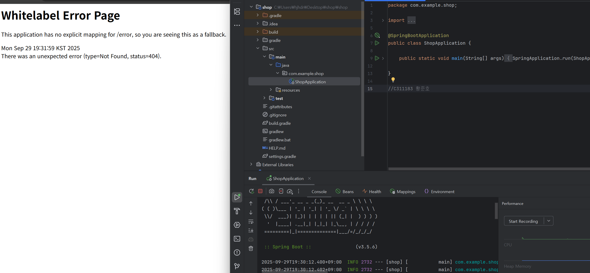

RESTful API설계, API 명세서
1. 회원 등록
    POST/ members
2. 회원 리스트 조회
    GET/ members
3. 회원 상세 조회
    GET/ members/ {memberId}
4. 회원 정보 수정
    PATCH/ members/ {memberId}
5. 회원 삭제
    DELETE/  members/ {memberId}

클라이언트가 서버에게 메인 페이지 데이터를 달라고 요청한후, 서버가 페이지 데이터를 주는 응답을 통해서 클라이언트는 웹에 접속 할 수 있다.

URL
SCHEME: 통신규칙
HOST: 서버 컴퓨터가 어디있는지 알려줌, IP주소 혹은 도메인
PORT: 서버의 특정 네트워크 포트번호, 일반적으로 생략
Path: 서버 내에서 원하는 리소스 경로
Query: 서버에 추가적인 정보를 줌

프론트엔드와 백엔드
화면의 뼈대는 재사용하고, 필요한 데이터만 서버에서 받아 다시 그림
프론트엔드: 받은 데이터를 화면에 갱신
백엔드: 실제동작처리, 데이터를 저장관리, 뼈대
       데이터베이스 사용

API: 한 프로그램이 다른 프로그램의 기능이나 데이터를 사용할 수 있도록 미리 정해놓은 규칙
